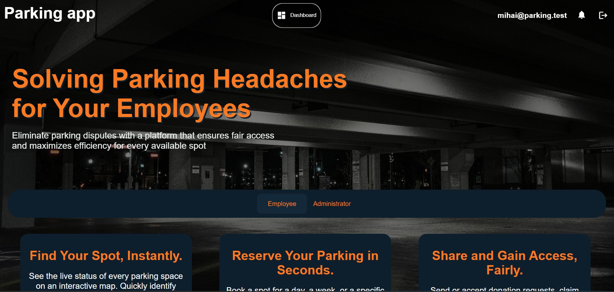
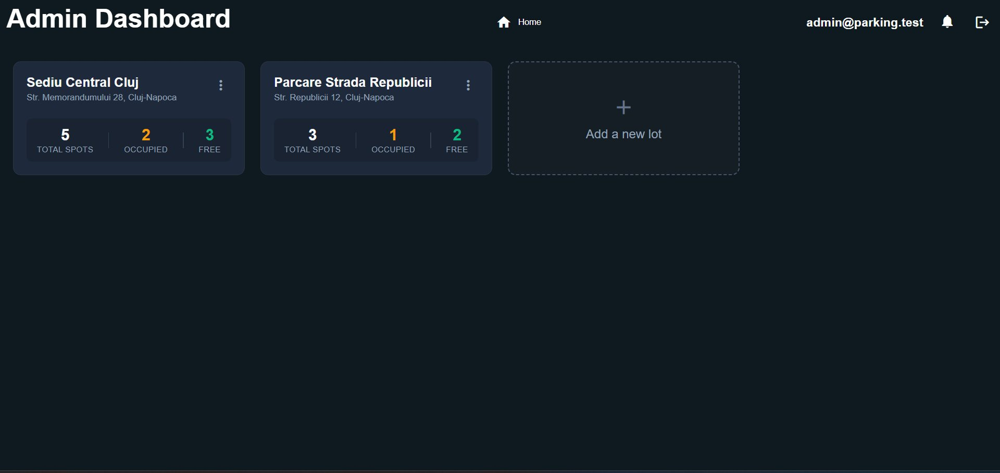
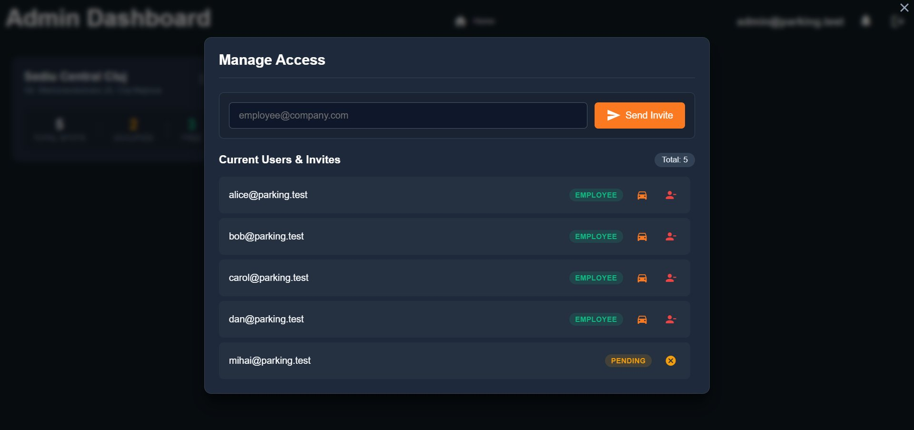
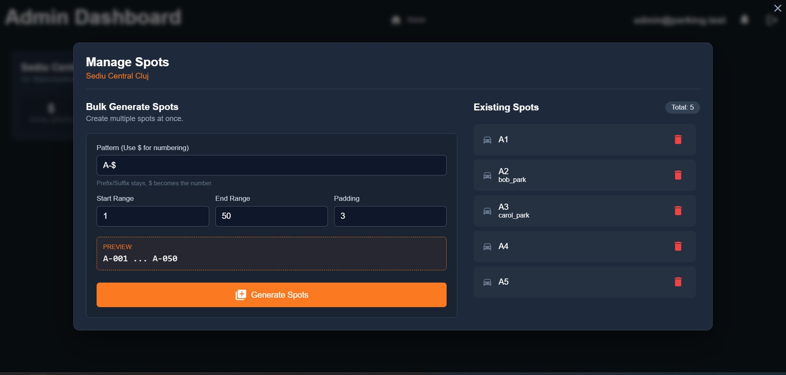
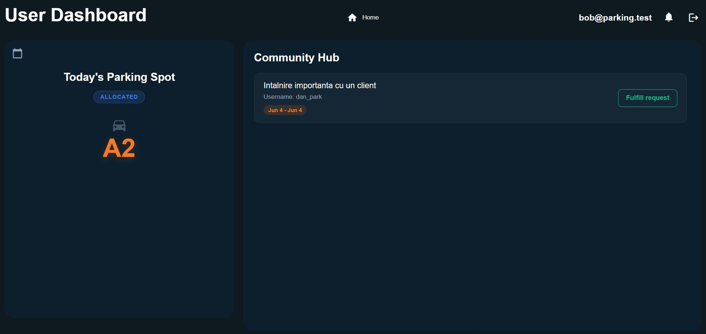
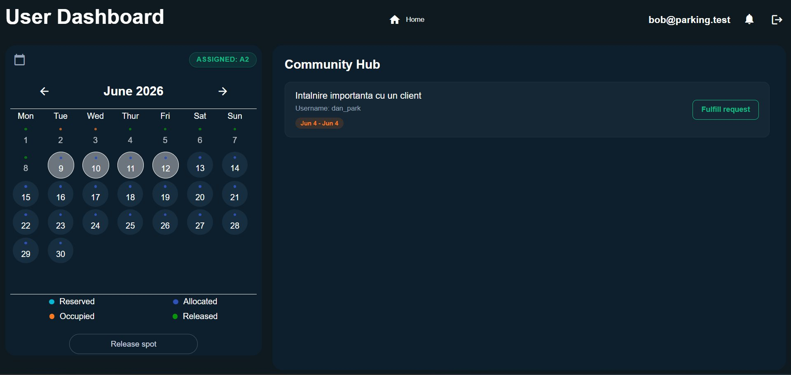
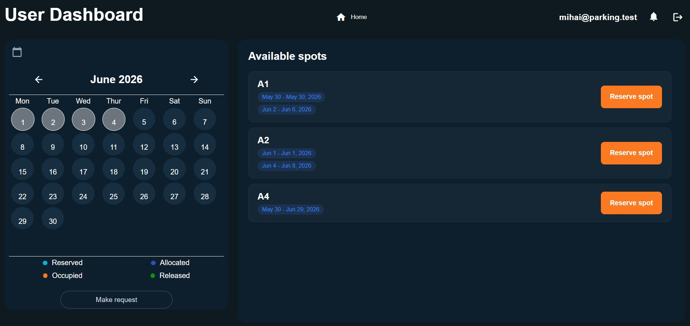

## ParkingApp — Corporate Parking Management

> A web application that turns workplace parking from a logistics headache into a fair, community-driven experience. Instead of relying on expensive hardware and complex allocation algorithms, ParkingApp lets employees **share their assigned spots** on days they are away, while colleagues reserve them or request them through a **Community Hub**.


---

## Overview

In many companies, parking spaces are a scarce, statically assigned resource: some spots sit empty while other employees have nowhere to park. **ParkingApp** addresses this with a model based on **social responsibility and transparency** rather than costly automation.

- Employees with a permanently allocated spot can **"donate"** it for the days they won't use it.
- Other employees can then **reserve** those freed spots, or post a **request** in the Community Hub when nothing is available.
- Administrators manage parking lots, spaces, and user access from a dedicated dashboard.

The result is higher spot utilization driven by collaboration between colleagues, with minimal infrastructure.

---

## Features

### For Employees
- View the parking spot assigned for the current day.
- Monthly **calendar** with color-coded status (reserved, allocated, occupied, released).
- **Release ("donate")** your own spot for a selected date range.
- Browse **available spots** and reserve them for a chosen interval.
- Post a **reservation request** to the Community Hub when no spot is free.
- Fulfill other colleagues' requests directly from the Hub.
- In-app and email notifications.

### For Administrators
- Dashboard with all managed parking lots and live **occupancy summary** (total / occupied / free).
- Create parking lots and **bulk-generate** spots from a configurable naming pattern.
- Invite employees by email and manage their access (invitations tracked as *pending*).
- Allocate spots permanently to specific employees.

---

## Screenshots

<p align="center">
  
</p>

<table>
  <tr>
    <td width="50%"><br/><sub><b>Admin dashboard — parking lots & occupancy</b></sub></td>
    <td width="50%"><br/><sub><b>Manage access & email invitations</b></sub></td>
  </tr>
  <tr>
    <td width="50%"><br/><sub><b>Bulk-generate parking spots</b></sub></td>
    <td width="50%"><br/><sub><b>Employee dashboard & Community Hub</b></sub></td>
  </tr>
  <tr>
    <td width="50%"><br/><sub><b>Calendar — release ("donate") a spot</b></sub></td>
    <td width="50%"><br/><sub><b>Browse & reserve available spots</b></sub></td>
  </tr>
</table>

---

## Tech Stack

| Layer            | Technology                                   |
| ---------------- | -------------------------------------------- |
| Frontend         | Angular 20, TypeScript (SPA)                 |
| Backend          | Node.js, Koa.js (REST API)                   |
| Database         | Microsoft SQL Server / Azure SQL Database    |
| Authentication   | JSON Web Tokens (JWT)                         |
| Email            | Nodemailer                                    |
| Cloud (target)   | Azure App Service, Static Web Apps, Azure SQL |

---

## Getting Started

### Prerequisites
- [Node.js](https://nodejs.org/) 20+
- [Microsoft SQL Server](https://www.microsoft.com/sql-server) (or an Azure SQL Database)
- [Angular CLI](https://angular.dev/tools/cli) (`npm install -g @angular/cli`)

### 1. Clone the repository
```bash
git clone https://github.com/Demeter1611/ParkingApp.git
cd ParkingApp
```

### 2. Backend
```bash
cd backend
npm install
```

Create a `config.json` file in the `backend/` folder:
```json
{
  "port": 4000,
  "databaseConfig": {
    "user": "your_db_user",
    "password": "your_db_password",
    "server": "localhost",
    "database": "parking_app",
    "options": {
      "encrypt": true,
      "trustServerCertificate": true
    }
  }
}
```

Run the backend (the database schema is created automatically via migrations on first run):
```bash
npm run dev    # development, with auto-reload (nodemon)
# or
npm start      # production
```
The API starts on `http://localhost:4000`.

### 3. Frontend
```bash
cd ../frontend
npm install
npm start
```
The app is served on `http://localhost:4200`.

----

## 🗺️ Roadmap

Planned future directions:
- Statistics & occupancy reports dashboard for administrators.
- Slack and Microsoft Teams notifications.
- Carpooling module (with optional allocation priority for participants).
- ANPR hardware integration for automatic barrier control.
- Native mobile app with push notifications and GPS navigation.

---

Developed as a bachelor's thesis project at the Faculty of Mathematics and Computer Science, Babeș-Bolyai University, Cluj-Napoca.
